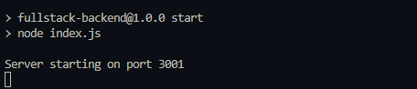

# fullstack

> Frontend & Backend в связке (API + асинхронный запрос с сервера)

- [Шпаргалка по API-запросам](#Шпаргалка-по-API-запросам)
- [Шпаргалка HTTP-response](#Шпаргалка-HTTP-response)
- [Запуск данного проекта](#Запуск-данного-проекта)
- [Настройка сервера backend c нуля](#Настройка-сервера-backend-c-нуля)
- [Настройка frontend-сервера с нуля (React + Webpack)](#настройка-frontend-сервера-с-нуля-react--webpack)
- [Настройка api для изменения данных в базе данных](#Настройка-api-для-изменения-данных-в-базе-данных)
- [Модульное программирование в backend](#Модульное-программирование-в-backend)
- [Установка автоматического перезапуска сервера в node.js](#Установка-автоматического-перезапуска-сервера-в-node)
- [Изменение json-файла в режиме работы сервера backend](#Изменение-json-файла-в-режиме-работы-сервера-backend)
- [Mobx хранилище](#Mobx-хранилище)

### Шпаргалка по API-запросам

- `GET` - получить данные
- `POST` - создать
- `PUT` - изменить или создать (hard change, если изменить одно поле - удаляет другие поля)
- `PUTCH` - изменить (изменить одно поле, не трогает другие поля)
- `DELETE` - удалить

### Шпаргалка HTTP-response

- `200` - Запрос выполнен успешно
- `201` - Запрос выполнен успешно, и в результате был создан новый ресурс
- `400` - Сервер не может или не будет обрабатывать запрос из-за того, что считается ошибкой клиента (например, некорректный синтаксис запроса, недопустимая структура сообщения запроса или обманчивая маршрутизация запроса)
- `401` - Проблемы с токеном, при авторизации
- `403` - У клиента нет прав доступа к содержимому, то есть он не авторизован, поэтому сервер отказывает в предоставлении запрошенного ресурса.
- `404` - Сервер не может найти запрошенный ресурс.
- `500` - Сервер столкнулся с ситуацией, которую он не знает, как обработать.
- `502` - Недоступность сервера / плохое соединение / обновление backend
- `503` - Сервер не готов обработать запрос. Распространёнными причинами являются отключение сервера на время обслуживания или его перегрузка

## Запуск данного проекта

1. Заходим в папку backend

```cmd
    cd backend-express
```

2. Устанавливаем зависимости

```cmd
    npm i
```

3. Запускаем сервер backend

```cmd
    npm run start
```

4. Открываем новый терминал заходим в папку frontend (react или vue)

```cmd
    cd frontend-_______(react, vue)
```

5. Устанавливаем зависимости

```cmd
    npm i
```

6. Запускаем сервер frontend

```cmd
    npm run start
```

## Настройка сервера backend c нуля

Создаём `package.json` в корне репозитория

```cmd
npm init -y
```

Переносим `package.json` в новую папку с работой backend. В моём случае это папка `backend-express`

Устанавливаем пакет `express` в `package.json` бека, для работы сервера

```cmd
npm i express
```

<span style='color: red'>!ВНИМАНИЕ!</span>

Добавьте `.gitignore` в корень репозитория, чтобы он отрабатывал на папки frontend и backend

Заполните файл `index.js` в папке бека

```js
const express = require("express"); // экземпляр для запуска пакетов сервера

// назначение порта для сервера (нельзя использовать 3000 порт, так как он используется для frontend)
const PORT = process.env.PORT || 3001;

// запуск приложения локального сервера
const app = express();

// слушатель app-приложения сервера
app.listen(PORT, () => {
  console.log(`Server starting on port ${PORT}`);
});
```

Изменить `package.json` в разделе `scripts` для запуска

```json
...
"scripts": {
    "start": "node index.js"
},
...
```

Запускаем сервер командой

```cmd
npm run start
```

Обратите внимание, что отработки данной команды вы должны находиться в папке бека `cd backend-express`

Правильный запуск backend-сервера выглядит:



Дописываем get-запрос для сервера в index.js

```js
app.get("/api", (req, res) => {
  res.json({
    message: "Hello from backend server",
  });
});
```

Перезапускаем сервер бека и вводим в любом браузере http://localhost:3001/**запрос**

В нашем случае http://localhost:3001/api выдаёт результат:

```json
{ "message": "Hello from backend server" }
```

## Настройка frontend-сервера с нуля (React + Webpack)

Для создания приложения frontend-приложения React + Webpack

1. запустите:

```cmd
npm init -y
```

или, если нужна ручная настройка `package.json`

```
npm init
```

2. Устанавливаем зависимости react

```
npm install react react-dom
```

3. Typescript

```
npm install --save-dev typescript @types/react @types/react-dom
```

4. Webpack

```
npm install --save-dev webpack webpack-cli webpack-dev-server html-webpack-plugin
```

5. Loaders

```
npm install --save-dev ts-loader css-loader style-loader file-loader
```

6. Создаём файл tsconfig.json в корне репозитория с содержимым:

```
{
    "compilerOptions": {
        "target": "es2016",
        "lib": ["dom", "dom.iterable", "esnext"],
        "jsx": "react-jsx",
        "module": "esnext",
        "moduleResolution": "node",
        "strict": true,
        "esModuleInterop": true,
        "skipLibCheck": true,
        "forceConsistentCasingInFileNames": true,
        "noEmit": false,
        "outDir": "./dist"
    },
    "include": ["src/**/*"],
    "exclude": ["node_modules"]
}
```

7. Создаём файл `webpack.config.ts`:
```
const path = require('path');
const HtmlWebpackPlugin = require('html-webpack-plugin');
// Минимзация файлов css
const MiniCssExtractPlugin = require('mini-css-extract-plugin');
const Dotenv = require('dotenv-webpack');

// Нужен для анализа, при финальной сборке проверить на память
const {
    BundleAnalyzerPlugin
} = require('webpack-bundle-analyzer');
// Очистка папок и кеша при каждой сборке
const {
    CleanWebpackPlugin
} = require('clean-webpack-plugin');

const CopyWebpackPlugin = require('copy-webpack-plugin');

// Оптимизация
const TerserPlugin = require('terser-webpack-plugin');

module.exports = {
    // Готовый продукт
    // mode: 'production',
    // Сборка для разработки
    mode: 'development',
    // Подключение map к сборке
    devtool: 'source-map',
    entry: './src/index.tsx',
    output: {
        path: path.resolve(__dirname, 'dist'),
        publicPath: '/',
        filename: '[name].[contenthash].js',  // Динамические имена для чанков
        clean: true,
    },
    resolve: {
        extensions: ['.tsx', '.jsx', '.ts', '.js'],
        alias: {
            '@': path.resolve(__dirname, 'src'),
        }
    },
    optimization: {
        minimize: true,
        minimizer: [new TerserPlugin({
            parallel: true, // Ускоряем минификацию
        })],
        splitChunks: {
            chunks: 'all', // Разделяем vendor код
        }
    },
    module: {
        rules: [
            {
                test: /\.(ts|tsx)$/,
                exclude: /(node_modules|bower_components)/,
                use: {
                    loader: 'ts-loader',
                    options: {
                        transpileOnly: true, // Ускоряет сборку
                        experimentalWatchApi: true, // Улучшает watch mode
                    },
                },
            },
            {
                test: /\.css$/,
                use: ['style-loader', 'css-loader'],
            },
            {
                test: /\.s[ca]ss$/,
                use: [MiniCssExtractPlugin.loader, 'css-loader', 'sass-loader']
            },
            {
                test: /\.(png|svg|jpg|jpeg|gif|mp3)$/i,
                type: 'asset/resource',
                generator: {
                    filename: 'assets/[hash][ext][query]' // Организация ассетов
                }
            },
            {
                test: /\.(woff|woff2|eot|ttf|otf)$/i,
                type: 'asset/resource',
                generator: {
                    filename: 'fonts/[hash][ext][query]'
                }
            }
        ],
    },
    plugins: [
        new HtmlWebpackPlugin({
            template: './public/index.html'
        }),
        new MiniCssExtractPlugin({
            filename: '[name].[contenthash].css', // Добавляем хеш
        }),
        new Dotenv(), // загружает переменные из .env
        new CopyWebpackPlugin({
            patterns: [
                {
                    from: path.resolve(__dirname, 'public'),
                    to: path.resolve(__dirname, 'dist'),
                    globOptions: {
                        ignore: ['**/index.html']
                    },
                    noErrorOnMissing: true // Не ругайся, если папка с файлами пуста
                }
            ]
        }),
        // Анализатор занятости места
        // new BundleAnalyzerPlugin(),
        // Очистка перед каждой сборкой
        new CleanWebpackPlugin()
    ],
    devServer: {
        static: {
            directory: path.join(__dirname, 'public'),
        },
        compress: true,
        port: 3000,
        hot: true,
        open: true,
        historyApiFallback: true,
        watchFiles: ['src/**/*', 'public/**/*'], // Явно указываем за какими файлами следить
        client: {
            overlay: {
                errors: true,
                warnings: false,
            },
        }
    },
};
```

8. Создаём файл `index.html` в папке `public`:

```
<!DOCTYPE html>
<html lang="en">
    <head>
        <meta charset="UTF-8">
        <meta name="viewport" content="width=device-width, initial-scale=1.0">
        <title>React TypeScript App</title>
    </head>
    <body>
        <div id="root"></div>
    </body>
</html>
```

9. В папке `src` -> файл `index.tsx`:

```
import React from 'react';
import ReactDOM from 'react-dom/client';
import App from './components/App';
import './styles/index.css';

const root = ReactDOM.createRoot(
    document.getElementById('root') as HTMLElement
);

root.render(
    <React.StrictMode>
        <App />
    </React.StrictMode>
);
```

Обратить внимение на <React.StrictMode> вызывает api запросы повторно (2 раза), для dev - допустимо, при раскатке - убрать

10. В папке `src` -> `components` -> файл `App.tsx`

```
import { BrowserRouter } from "react-router-dom";
import Router from "../router/Router";

function App() {
    return (
        <BrowserRouter>
            <Router />
        </BrowserRouter>
    );
}

export default App;
```

и устанавливаем `router`

```
npm install react-router-dom --save
```

создаём папку `router` -> с файлом `Router.tsx`

```
import { Route, Routes } from 'react-router-dom';

import MainPage from '../components/pages/MainPage';

const Router = () => {
    return (
        <Routes>
            <Route path="/" index element={<MainPage />} />
        </Routes>
    );
};

export default Router;
```

11. В папке `components` -> создаём папку `pages` -> файл `MainPage.tsx`

```
const MainPage = () => {
    return <div>
        Main Page
    </div>
}

export default MainPage;
```

12. Переназначаем конфликтные import в файлах, котоыре светятся с ошибками

13. В папке `src` -> папку `styles` -> файл `index.scss` или `index.css`:

```
body {
    font-family: Arial, sans-serif;
    margin: 0;
    padding: 20px;
}

h1 {
    color: #333;
}
```

14. `package.json` добиваем:

```
...
"scripts": {
    "start": "webpack serve --mode development",
    "build": "webpack --mode production",
    "test": "echo \"Error: no test specified\" && exit 1"
},
...
```

15. Используем `ts` в `webpack`

```
npm install --save-dev typescript ts-node
```

---

```
npm install --save-dev @types/node
```

16. Устанавливаем plugin для улучшения webpack

```
npm install copy-webpack-plugin --save-dev
```

---

```
npm i mini-css-extract-plugin --save-dev
```

---

```
npm i webpack-bundle-analyzer --save-dev
```

---

```
npm i clean-webpack-plugin --save-dev
```

---

```
npm install sass-loader sass webpack --save-dev
```

17. Устанавливаем `mobx` или `redux`, описаны будут позже

18. Создаём в корне репозитория файлы: `.env` и ` .env.production`

```
REACT_APP_BASEURL=http://localhost:3001
```

где `http://localhost:3001` адрес сервера backend для dev-разработки и production

устанавливаем работу с `.env` в webpack
```
npm install dotenv-webpack --save-dev
```

19. Запускаем сборку
    Для разработки

```
npm run start --dev
```

Для production

```
npm run start
```

20. Устанавливаем `axios` для работы с api

```
npm install axios
```

21. Создаём файл в `src` -> `api` -> `index.ts`

```
import axios from "axios";

export const $api = axios.create({
    baseURL: `${process.env.REACT_APP_BASEURL}`,
});

export const config = () => {
    return {
        'Access-Control-Allow-Headers': '*',
        'Access-Control-Expose-Headers': '*',
        'Access-Control-Allow-Origin': '*'
    }
}

$api.interceptors.response.use(function (response) {
    // Любой код состояния, находящийся в диапазоне 2xx, вызывает срабатывание этой функции
    // Здесь можете сделать что-нибудь с ответом
    return response;
}, function (error) {
    if (error.response != null) {
        const numberStatus: number = Math.round(error.response.status / 100);
        switch (numberStatus) {
            case 4:
                switch (error.response.status) {
                    case 400:
                        window.location.replace(`/error?code=${error.response.status}`);
                        break;
                    case 401:
                    case 403:
                        // Переход. Если не прошёл авторизацию
                        window.location.replace("/");
                        break;
                    case 404:
                    case 405:
                        window.location.replace(`/error?code=${error.response.status}`);
                        break;
                }
                break;
            case 5:
                // if (error.response.status >= 500 && error.response.status <= 505) {
                //     window.location.replace(`/error?code=${error.response.status}`);
                // }
                break;
            default:
                // window.location.replace("/error");
                break;
        }
    }

    // if (error.response == null) {
    //     window.location.replace("/error");
    //     return;
    // }

    // Любые коды состояния, выходящие за пределы диапазона 2xx, вызывают срабатывание этой функции
    // Здесь можете сделать что-то с ошибкой ответа
    return Promise.reject(error);
});
```

22. В папке `api` создаём папку `controllers` -> файл `___-controller.ts`, в моём случае `common-controller.ts`

```
import { $api, config } from "../index";

export const getCommon = () => {
    return $api.get('/api', { headers: config() });
}
```

В `MainPage` для запроса используем `useEffect`

```tsx
useEffect(() => {
  getCommon()
    .then((response) => {
      console.log(response);
    })
    .catch((e) => console.log(e));
}, []);
```

`getCommon` - это контроллер в `common-controller.ts`, чтобы он отработал нужно:

- Запрос через `axios` не сработает из-за `cors`, нужно отключить cors в браузере и пользоваться
  -Для отключения `cors` надо в ярлыке браузере Google через свойство в поле `объект` вставить после расположения строки:

```
--disable-web-security --user-data-dir="C:\Users\ndecarteret121\AppData\Local\Google\Chrome\Testing"
```

Снятие защиты с браузера (перевод в тестовый режим)

Запрос будет не корректный, если backend-сервер не будут запущен

Смотрим файл `MainPage.tsx` для работы с вытаскиванием данных с сервера

23. Создаём папки
 - `components` в `components`
 - `layouts` в `components`
 - `types`
 - `store`

Для запуска сервера frontend:

1. Перейти в папку frontend (в моём случае frontend-react) `cd frontend-react`
2. Ввести команду

```cmd
npm i
```

3. Запуск сервера frontend

```cmd
npm run start -dev
```

## Настройка api для изменения данных в базе данных

Для изменения данных по параметру id добавляем в сервер backend строки

```JavaScript
app.use(express.json()); // работа с данными передаваемые с фронта

app.put('/api/data/:id', (req, res) => {
	const id = req.params.id;
	const updatedData = req.body; //! Не сработает без - app.use(express.json());

	if (data.id !== parseInt(id)) {
		return res.status(404).send("Data not found");
	}

	data = { ...data, ...updatedData }; // изменение данных на сервере

	res.json(data); // возврат данных на ответ
});
```

Запрос на изменение данных по кнопке со стороны frontend

```JavaScript
const [data, setData] = React.useState<dataDto>(); // dataDto тип передаваемых / получаемых данных

const changeData = () => {
  let localData = data ? data : { id: 2, age: 30, name: 'Stas' };

  localData.name = 'Stas';
  localData.age = 31;

  if (localData.id) {
    editDataId(localData.id, localData)
      .then(response => {
        setData(response.data)
      })
      .catch(e => console.log(e));
  }
}

return <Box
  sx={{
    width: '900px',
    m: '0 auto'
  }}
  >
    <ul>
      <li>id: {data?.id}</li>
      <li>name: {data?.name}</li>
      <li>age: {data?.age}</li>
    </ul>
    <Button
      onClick={changeData}
      variant='contained'
      color='error'
    >
      Изменить данные
    </Button>
  </Box>
```

## Модульное программирование в backend

Настройка модульного программирования для backend, чтобы разделять api в разные файлы + и на отдельные json-файлы с данными

Изменяем в `packege.json` строку с `type`

```json
...
"type": "module",
...
```

<span style='color: red'>!ВНИМАНИЕ!</span>

После таких изменений перестают работать `require` и `import`

- При использовании `import` - обязательно нужно указывать расширение (.js, .json, и д.р.)
- `require` - вообще перестаёт работать, но в библиотеке module (папка node modules), есть строки кода, которые описывают инструкцию поведния `require`

```js
import { createRequire } from "module";
const require = createRequire(import.meta.url);

const express = require("express");
```

`const require` - выступает в роли переменной, с инструкцией по подключению не на прямую

Плюсы такого подхода - это раздление на отдельные файлы с отдельной логикой, чтобы не было пересечения между страницами компонентов

### Установка автоматического перезапуска сервера в node

Установить `nodemon` - для этого ввести в командную строку:

```cmd
npm install --save-dev nodemon
```

Установка происходит локально, а не глобально, изменить в `package.json` строки для запуска приложения в backend:

```json
...
"scripts": {
  "start": "nodemon index.js" // прежнее состояние "start": "node index.js"
},
...
```

### Изменение json-файла в режиме работы сервера backend

Используется библиотека `fs`

Для работы в файле js используются строки:

```js
const fs = require("fs"); // Подключение библиотеки fs
```

Изменение файла json

```js
fs.writeFileSync("data.json", JSON.stringify(data, null, 4)); // Обновление файла-json
```

Параметры `fs.writeFileSync`:

- `data.json` - файл перезаписи данных
- ~@Второй параметр~ - данные, которые должны быть помещены в файл-json

Параметры `JSON.stringify`:

- `data` - данные, котоыре должны быть переведены в строчное значение, с помощью `stringify`
- остальные параметры не обязательные, но тогда файл будет в строку, занимать меньше места и обратываться быстрее (желательно оставлять таким образом), если нужно прочтение в json-файле, то остальные параметры обозначают метод форматирования json-файла, `4` - обозначает количетсво пробелов при табулировании между объектами

### Mobx

1. Установите MobX и React интеграцию

```
npm install mobx mobx-react
```

2. Основные концепции:

- Observable state - данные, за которыми следит MobX
- Actions - методы, которые изменяют состояние
- Computed values - производные значения из состояния
- Reactions - автоматические реакции на изменения состояния

3. Создаём `CouterStore.ts` в папке `stores` -> `store`
```
import { makeObservable, observable, action } from 'mobx';

class CounterStore {
    count = 0;

    constructor() {
        makeObservable(this, {
            count: observable, // отслеживание переменной
            increment: action, // метод изменения данных
            decrement: action
        });
    }

    increment = () => {
        this.count++;
    };

    decrement = () => {
        this.count--;
    };
}

const counterStore = new CounterStore();
export default counterStore;
```

4. Обернуть `react-компонент` в `observer`, чтобы взаимодействовать с данными

```
import { observer } from "mobx-react";

const Mobx = observer(() => {
    return <div>

    </div>
});

export default Mobx;
```

5. Данные можно изменять, и смотреть

```
import counterStore from "../../stores/store/CounterStore";

import { observer } from "mobx-react";

const Mobx = observer(() => {
    return <div>
        <h1>{counterStore.count}</h1>
        <button onClick={counterStore.increment}>+</button>
        <button onClick={counterStore.decrement}>-</button>
        <h2>{counterStore.doubleCount}</h2>
    </div>
});

export default Mobx;
```

6. Создаём `TestStore.ts` в папке `stores` -> `store`
```
import { makeObservable, observable, action, runInAction, computed } from 'mobx';
import { testData } from '../../api/controllers/common-controller';
import { testDataDto } from '../../types/testData';

export class TestStore {
    testData: testDataDto[] = [];
    loading = false;
    error = false;

    constructor() {
        makeObservable(this, {
            testData: observable,
            loading: observable,
            error: observable,
            dataLength: computed,
            fetchData: action
        });
    }

    fetchData = async () => {
        this.loading = true;

        await testData()
            .then((response) => {
                runInAction(() => {
                    this.testData = response.data;
                    this.loading = false;
                })
            })
            .catch((error) => {
                console.log(error);
                runInAction(() => {
                    this.error = true;
                    this.loading = false;
                })
            })
    };

    get dataLength() {
        return this.testData.length;
    }
}
```

7. Данные можно просмотреть
```
import { observer } from "mobx-react";
import counterStore from "../../stores/store/CounterStore";
import testStore from "../../stores/store/TestStore";
import { useEffect } from "react";

const Mobx = observer(() => {
    useEffect(() => {
        testStore.fetchData()
    }, [])

    return <div>
        <h1>{counterStore.count}</h1>
        <button onClick={counterStore.increment}>+</button>
        <button onClick={counterStore.decrement}>-</button>
        <h2>{counterStore.doubleCount}</h2>
        <hr></hr>
        {testStore.loading ?
            'Загрузка'
            :
            (
                <>
                    <ol>
                        {
                            testStore.testData.map((item, ind) => (
                                <li key={ind}>
                                    {item.id} / {item.name} / {item.age}
                                </li>
                            ))
                        }
                    </ol>
                    {testStore.error ? null : testStore.dataLength}
                </>
            )
        }
        {testStore.error ? 'Ошибка' : null}
    </div>
});

export default Mobx;
```

8. Запуск через единый `root-файл`
в папке `stores` создаём `RootStore.ts`
```
import { makeObservable } from 'mobx';
import { TestStore } from './store/TestStore';
import { CounterStore } from './store/CounterStore';

export class RootStore {
    testStore: TestStore;
    counterStore: CounterStore;

    constructor() {
        // Передаем текущий экземпляр RootStore в дочерние хранилища
        this.testStore = new TestStore(this);
        this.counterStore = new CounterStore(this);

        //  Настройка MobX наблюдение
        // - this: наблюдаемый объект
        // - {}: нет полей для наблюдения (они в дочерних хранилищах)
        // - { autoBind: true }: автоматическая привязка методов
        makeObservable(this, {}, { autoBind: true });
    }
}

// Создаем экземпляр корневого хранилища
const rootStore = new RootStore();
export default rootStore;
```

в папке `stores` создаём `RootStoreContext.ts`
```
import { createContext, useContext } from 'react';
import { RootStore } from './RootStore';

export const RootStoreContext = createContext<RootStore | null>(null);

export const useStores = () => {
    const store = useContext(RootStoreContext);
    if (!store) {
        throw new Error('useStores must be used within a StoreProvider');
    }
    return store;
};
```

В `index.tsx` добавить
```
...
import { RootStoreContext } from './stores/RootStoreContext';
import rootStore from './stores/RootStore';
...

...
<RootStoreContext.Provider value={rootStore}>
    <App />
</RootStoreContext.Provider>
...
```

Компонент `Mobx.tsx`
```
import { observer } from "mobx-react";
import { useEffect } from "react";
import { useStores } from "../../stores/RootStoreContext";

const Mobx = observer(() => {
    // Получаем хранилища через контекст
    const { testStore, counterStore } = useStores();

    useEffect(() => {
        testStore.fetchData()
    }, [])

    return <div>
        <h1>{counterStore.count}</h1>
        <button onClick={counterStore.increment}>+</button>
        <button onClick={counterStore.decrement}>-</button>
        <h2>{counterStore.doubleCount}</h2>
        <hr></hr>
        {testStore.loading ?
            'Загрузка'
            :
            (
                <>
                    <ol>
                        {
                            testStore.testData.map((item, ind) => (
                                <li key={ind}>
                                    {item.id} / {item.name} / {item.age}
                                </li>
                            ))
                        }
                    </ol>
                    {testStore.error ? null : testStore.dataLength}
                </>
            )
        }
        {testStore.error ? 'Ошибка' : null}
    </div>
});

export default Mobx;
```

9. Реакции `Mobx`
* autorun
Выполняет функцию сразу и при каждом изменении зависимостей:
```
import { autorun } from 'mobx';

autorun(() => {
  console.log(`Данные загружены: ${store.testData.length} элементов`);
});
```
- Используйте для логирования, аналитики или синхронизации с localStorage.
---
* reaction
Запускает эффект только при изменении конкретных данных:
```
import { reaction } from 'mobx';

reaction(
  () => store.testData.length, // Отслеживаемое значение
  (length) => {
    if (length > 10) alert('Данных больше 10!');
  }
);
```
- Используйте для условных действий (например, уведомлений).
---
* when
Выполняет действие один раз при выполнении условия:
```
import { when } from 'mobx';

when(
  () => store.testData.length > 0,
  () => {
    console.log('Данные наконец загружены!');
  }
);
```
- Используйте для одноразовых инициализаций.